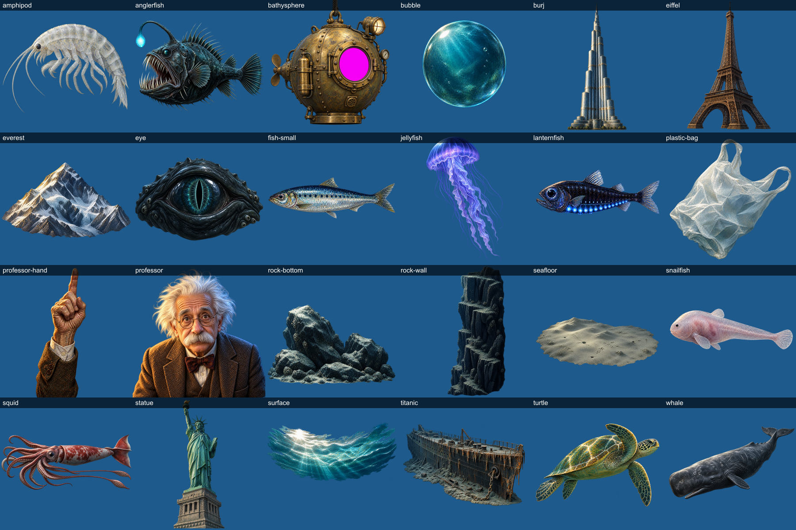
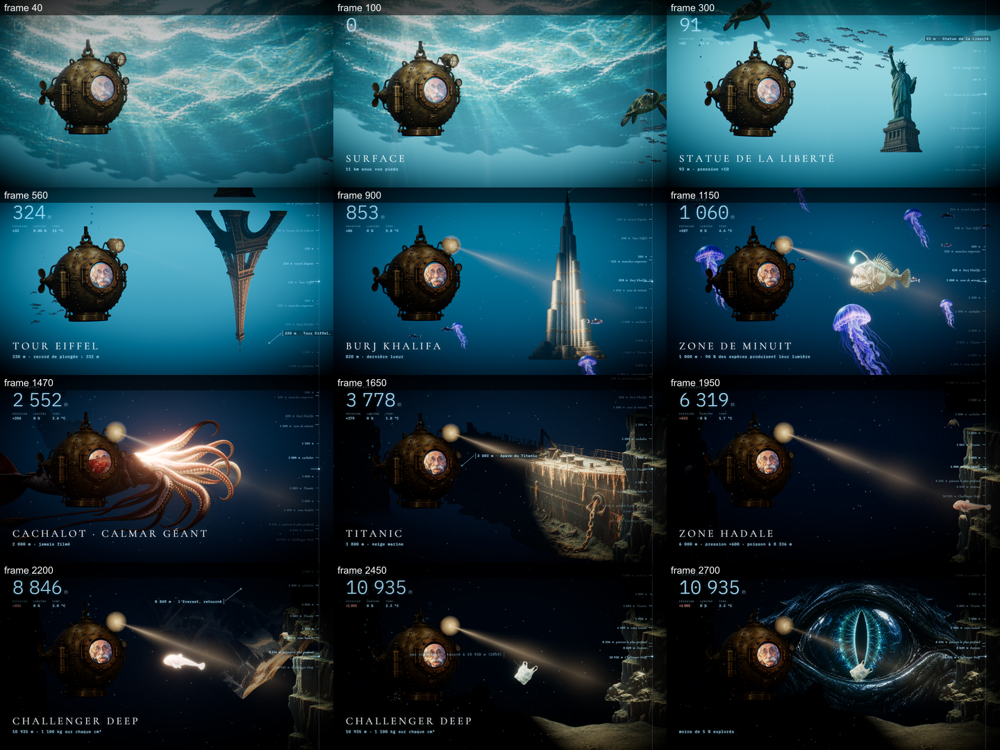

# cinematic-film

A [Claude Code](https://claude.com/claude-code) skill that turns a subject into a short **cinematic animated film**
(60–120 s) with Remotion + three.js: painted assets generated with gpt-image and cut out, a rigged narrator whose
mouth follows the voice, TTS voice-over, royalty-free synthesized music and sound effects, a continuous
one-shot camera, real fog / lights / particles, bloom + grain post-processing, and a data HUD (counter,
readouts, ruler, 3D-anchored labels).

It was built while producing **Abysses**, a 94 s descent from the surface to the Challenger Deep, narrated by an
Einstein-like professor in a brass bathysphere. The full example lives in `templates/example-abysses/`.




## Install

```bash
# as a Claude Code skill (user-wide)
git clone https://github.com/minosdevs/cinematic-film ~/.claude/skills/cinematic-film
```

Requirements on the machine: Node 20+, ffmpeg/ffprobe on the PATH, an `OPENAI_API_KEY` (gpt-image-2.5 for
assets, gpt-4o-mini-tts for the voice). A GPU helps but is not required (`--gl=swangle`).

Then, in Claude Code, ask for a film: *"a 90 s mysterious, educational video about the layers of the
atmosphere, narrated by an old aviator"*. The skill triggers on requests for a high-quality narrative video,
a documentary-style explainer, a journey / descent / timeline with facts per level, or anything that must
not look like a slideshow.

## What is inside

| path | role |
|---|---|
| `SKILL.md` | the workflow Claude follows: brief → script & timeline → assets → audio → staging → headless stills → render |
| `scripts/` | pipeline: `setup.mjs` (scaffold), `gen-assets.mjs`, `contact-sheet.mjs`, `process-assets.mjs`, `gen-vo.mjs`, `build-timeline.mjs`, `make-audio.mjs`, `stills.mjs` |
| `templates/base/` | the generic engine: continuous camera, environment by progress, `Sprite3D` (swim / jelly / squid / flag / breathe shaders), rigged `Narrator`, particles, light rays, imperative post-processing, config-driven HUD |
| `templates/example-abysses/` | the complete source of the example film (script, asset manifest, choreography) |
| `references/` | `wow.md` (what makes it cinematic instead of a collage), `pitfalls.md` (headless rendering traps), `prompts.md` (gpt-image prompt patterns), `example-abysses.md` |

## Pipeline in five commands

```bash
node <skill>/scripts/setup.mjs ../my-film --name "Title"      # scaffold + npm install
node scripts/gen-vo.mjs ash && node scripts/build-timeline.mjs ash 1.06   # voice -> timeline.json
node scripts/gen-assets.mjs && node scripts/process-assets.mjs            # painted cutouts -> meta.json
node scripts/make-audio.mjs                                               # music + sfx synced to the timeline
node scripts/stills.mjs --sheet && npx remotion render Film out/film.mp4 --gl=angle
```

Everything that changes with the subject lives in three places: `scripts/vo-script.json` (lines, labels,
values, events), `scripts/assets.json` + `process.json` (what to paint, how to cut it), and
`src/film.config.ts` + `src/scene/Story.tsx` + `src/tags.ts` (camera, mood, staging, labels).

## Two things worth knowing before touching the engine

1. In headless rendering, Remotion draws **one** three.js frame per image. Anything that arrives after the
   first React commit (a texture, a post-processing pass) is never drawn. The engine therefore builds the
   `postprocessing` composer imperatively, preloads textures and audio before mounting the canvas, and keeps a
   `Readvance` safety net. Do not replace these with the declarative wrappers.
2. `pow(x, k)` with a slightly negative `x` in a shader yields NaN, and bloom spreads a NaN into a hard-edged
   black block. Always `pow(max(0.0, x), k)`.

## License

MIT
